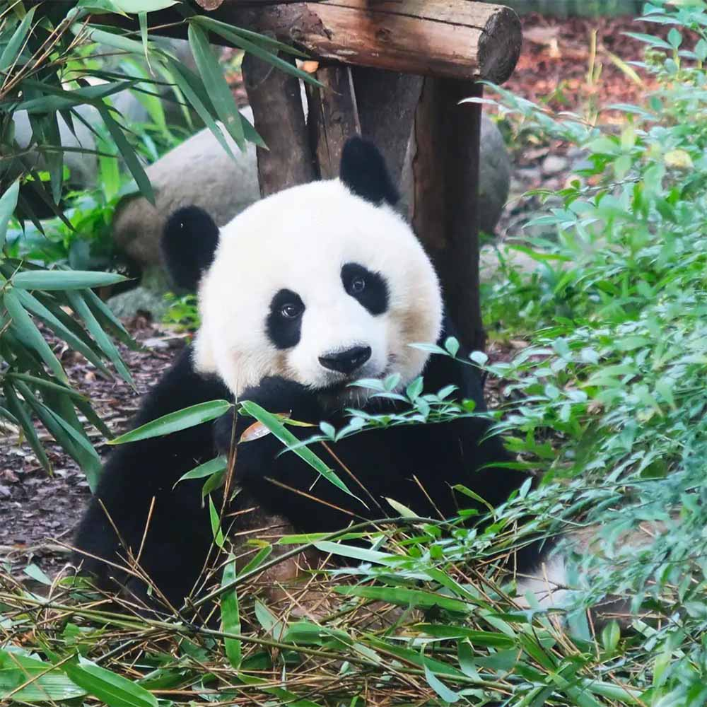

# POINTS-Qwen-2-5

## 1. 模型介绍

[POINTS-Qwen](https://huggingface.co/WePOINTS/POINTS-Qwen-2-5-7B-Chat) 融合了视觉语言模型的最新研究进展，并采用了微信AI团队提出的前沿创新技术。

- **强大的基线**：将视觉-语言模型领域的最新进展，即CapFusion、双视觉编码器和动态高分辨率技术，整合到POINTS中

- **预训练数据集过滤**：提出使用困惑度（perplexity）作为指标来过滤预训练数据集。通过这种过滤策略，可以显著减少预训练数据集的规模，同时提升模型的性能。

- **模型融合（Model Soup）**：提出对使用不同视觉指令微调数据集进行微调的模型应用模型融合技术，这可以进一步显著提升模型的性能。

**本仓库支持的模型权重:**

| Model              |
|--------------------|
| WePOINTS/POINTS-Qwen-2-5-7B-Chat |


## 2 环境准备
1）[安装PaddlePaddle](https://github.com/PaddlePaddle/PaddleMIX?tab=readme-ov-file#3-%EF%B8%8F%E5%AE%89%E8%A3%85paddlepaddle)
- **python >= 3.10**
- **paddlepaddle-gpu 要求是3.0.0b2或develop版本**
```bash
# 提供三种 PaddlePaddle 安装命令示例，也可参考PaddleMIX主页的安装教程进行安装

# 3.0.0b2版本安装示例 (CUDA 11.8)
python -m pip install paddlepaddle-gpu==3.0.0b2 -i https://www.paddlepaddle.org.cn/packages/stable/cu118/

# Develop 版本安装示例
python -m pip install paddlepaddle-gpu==0.0.0.post118 -f https://www.paddlepaddle.org.cn/whl/linux/gpu/develop.html

# sh 脚本快速安装
sh build_paddle_env.sh
```

2）[安装PaddleMIX环境依赖包](https://github.com/PaddlePaddle/PaddleMIX?tab=readme-ov-file#3-%EF%B8%8F%E5%AE%89%E8%A3%85paddlepaddle)
- **paddlenlp >= 3.0.0b3**

```bash
# 提供两种 PaddleMIX 依赖安装命令示例

# pip 安装示例，安装paddlemix、ppdiffusers、项目依赖、paddlenlp
python -m pip install -e . --user
python -m pip install -e ppdiffusers --user
python -m pip install -r requirements.txt --user
python -m pip install paddlenlp==3.0.0b4 --user

# sh 脚本快速安装
sh build_env.sh
```

> 注：
* 请确保安装了以上依赖，否则无法运行。同时，需要安装 paddlemix/external_ops 下的自定义OP, `python setup.py install`。如果安装后仍然找不到算子，需要额外设置PYTHONPATH
* (默认开启flash_attn)使用flash_attn 要求A100/A800显卡或者H20显卡。V100请用float16推理。

## 3 模型转换

将torch模型转换成paddle模型，请采用下述命令。

```bash
# 单图推理
python paddlemix/examples/points_qwen2_5/convert_torch_to_paddle.py --torch_model_path ./models/POINTS-Qwen-2-5-7B-Chat/ --paddle_model_path ./models/POINTS-Qwen-2-5-7B-Chat_pd
```

## 4 快速开始

### 推理

```bash
# 单图推理
python paddlemix/examples/points_qwen2_5/image_infer.py --model_path ./models/POINTS-Qwen-2-5-7B-Chat_pd/ --image_file ./paddlemix/demo_images/examples_image2.jpg
```



**Prompt:**

>please describe the image in detail

**Result:**

>The image features a giant panda sitting amidst a lush environment. The panda, with its distinctive black and white fur, is holding a bamboo shoot, which is a staple in its diet. The panda's eyes are looking slightly to the side, giving it a contemplative expression. Surrounding the panda are various green plants, including bamboo shoots and other foliage, which contribute to the natural of a natural habitat. The ground is covered with what appears to be a layer of mulch or soil, and the overall setting suggests a well-maintained enclosure, likely within a zoo or conservation area.


### 参考文献

```BibTeX
@article{liu2024points,
  title={POINTS: Improving Your Vision-language Model with Affordable Strategies},
  author={Liu, Yuan and Zhao, Zhongyin and Zhuang, Ziyuan and Tian, Le and Zhou, Xiao and Zhou, Jie},
  journal={arXiv preprint arXiv:2409.04828},
  year={2024}
}

@article{liu2024rethinking,
  title={Rethinking Overlooked Aspects in Vision-Language Models},
  author={Liu, Yuan and Tian, Le and Zhou, Xiao and Zhou, Jie},
  journal={arXiv preprint arXiv:2405.11850},
  year={2024}
}

```
