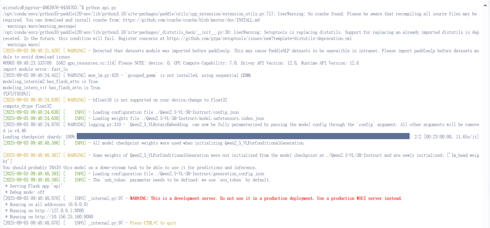

# 百度Aistudio搭建API教程

## 创建环境

前往[飞桨AI Studio星河社区-人工智能学习与实训社区](https://aistudio.baidu.com/my/project)登陆后选择项目-创建项目-NoteBook

PaddlePaddle版本建议选择3.1.1


# 安装相关环境

安装PaddleMIX框架

这里建议将所有的安装环境过程都写入build_env.sh文件中

后续部署API时需要用到

```
bash ./build_env.sh
```

## 运行模型

**API仅支持paddlepaddle框架，不支持torch！**

paddlepaddle运行模型的方法可以参考/PaddleMIX-develop/paddlemix/examples

具体的python代码可以参考api.py

### 端口号与IP地址

aistudio仅有8080号端口部署时可以被外界访问到，**建议与api.py中相同**

```
if __name__ == '__main__':
    app.run(host="0.0.0.0", port=8080, threaded=False)
```

### api服务

这里需要一个支持post方法的接口，这个接口需要接受调用api的请求

具体的api路径可以自行定义

```
@app.route('/v1/chat/completions',methods=['POST'])
def chat_completions():
    """处理聊天完成请求"""
    print("收到处理请求")
    # 解析请求数据
    try:
        request_data = request.get_json()
        
        if not request_data:
            return jsonify({"error": {"message": "无效的请求数据", "type": "invalid_request"}}), 400
    except Exception as e:
        return jsonify({"error": {"message": f"解析请求失败: {str(e)}", "type": "parse_error"}}), 400
    # 提取参数
    temperature = request_data.get("temperature", 0.6)

    
    try:
        # 处理消息
        processed_messages = process_request_data(request_data)
        
        response = generate_response(processed_messages, temperature)
        return response
    
    except Exception as e:
        return jsonify({"error": {"message": f"处理请求失败: {str(e)}", "type": "server_error"}}), 500

@app.route('/')
def home():
    return 'Qwen2.5-VL API服务正在运行'
```

### 处理数据

后端程序接受到请求后需要将data解析成满足模型对话的message格式

由于涉及到图像的传输，这里使用base64编码的格式进行传输，后端将图像解码后保存到本地

各位选手可以根据需要自行修改

```
def process_image(image_source):
    """处理图像，HTTP链接直接返回网址，base64编码保存本地并返回路径"""
    # 定义本地图片保存目录（可根据需要修改）
    SAVE_DIR = "./images"
    # 确保保存目录存在
    os.makedirs(SAVE_DIR, exist_ok=True)
    
    try:
        if image_source.startswith(('http://', 'https://')):
            # HTTP/HTTPS链接直接返回原网址
            return image_source
        else:
            # 处理base64编码的图像
            # 去除可能的base64前缀（如data:image/png;base64,）
            if 'base64,' in image_source:
                image_source = image_source.split('base64,')[1]
            
            # 解码base64数据
            image_data = base64.b64decode(image_source)
            image = Image.open(BytesIO(image_data))
            
            # 生成唯一文件名（避免冲突）
            file_name = f"{uuid.uuid4().hex}.png"  # 使用UUID确保唯一性
            save_path = os.path.join(SAVE_DIR, file_name)
            
            # 保存图像到本地
            image.convert("RGB").save(save_path)  # 统一转为RGB格式保存
            
            # 返回本地文件路径（可根据需要返回绝对路径或相对路径）
            return os.path.abspath(save_path)
    
    except Exception as e:
        raise ValueError(f"图像处理失败: {str(e)}")

def process_request_data(request_data):
    """处理请求数据，转换为模型输入格式"""
    messages = request_data.get("messages", [])
    processed_messages = []
    
    for msg in messages:
        role = msg.get("role", "user")
        content = msg.get("content", [])
        
        processed_content = []
        for item in content if isinstance(content, list) else [{"type": "text", "text": content}]:
            if item["type"] == "text":
                processed_content.append({"type": "text", "text": item["text"]})
            elif item["type"] == "image":
                image = process_image(item["image"])
                processed_content.append({"type": "image", "image": image})
        
        processed_messages.append({"role": role, "content": processed_content})
    print(processed_messages)
    return processed_messages
```

### 模型回答

将data数据处理成正确的对话格式后进行问答

各位选手可以根据需求修改

```
def generate_response(messages, temperature=0.6):
    """调用模型生成响应"""
    # 准备模型输入
    texts = [processor.tokenizer.apply_chat_template(messages, tokenize=False, add_generation_prompt=True)]

    # Preparation for inference
    image_inputs, video_inputs = process_vision_info(messages)

    inputs = processor(
        text=texts,
        images=image_inputs,
        videos=video_inputs,
        padding=True,
        return_tensors="pd",
    )

    # Inference: Generation of the output
    generated_ids = model.generate(
        **inputs, max_new_tokens=max_new_tokens, temperature=temperature, top_p=top_p
    )  # already trimmed in paddle

    output_text = processor.batch_decode(
        generated_ids[0], skip_special_tokens=True, clean_up_tokenization_spaces=False
    )
    return output_text[0]
```

# 测试程序是否正确

## 运行程序

新建终端，运行python api.py

出现类似于下方的输出代表api已经开始运行了



## 访问api服务

get方法可以通过网页访问

首先观察你打开aistudio版的VScode的网页页面

应该为类似于https://aistudio.baidu.com/bj-gpu-03/user/4****6/9****3/home#codelab

删除home#codelab后添加api_serving/8080/即为访问api的地址

https://aistudio.baidu.com/bj-gpu-03/user/4****6/9****3/api_serving/8080/

使用网页打开该地址出现下面的文本则代表着home函数运行成功


post方法访问建议在aistudio的终端中进行访问

首先打开test_connection.py

修改api_url为http://127.0.0.1:8080

api_key获取链接https://aistudio.baidu.com/account/accessToken

根据需要修改对话格式，新建终端运行test_connection.py，当控制台正常输出时代表API可以正常运行

```
def call_qwen_vl_api(question, image_path, api_url="api_url", api_key="your_key"):
    """
    调用Qwen2.5-VL API服务
    """
    # 检查图片文件是否存在
    if not os.path.exists(image_path):
        raise FileNotFoundError(f"图片文件不存在: {image_path}")
    
    # 获取图片文件的MIME类型
    file_ext = os.path.splitext(image_path)[1].lower()
    mime_type = {
        '.jpg': 'image/jpeg',
        '.jpeg': 'image/jpeg',
        '.png': 'image/png',
        '.gif': 'image/gif',
        '.bmp': 'image/bmp'
    }.get(file_ext, 'image/jpeg')
    
    # 将图片转换为base64编码
    with open(image_path, "rb") as image_file:
        base64_encoded = base64.b64encode(image_file.read()).decode('utf-8')
        image_data = f"data:{mime_type};base64,{base64_encoded}"
    
    # 构造请求数据
    payload = {
        "model": "Qwen/Qwen2.5-VL-3B-Instruct",
        "temperature": 0.6,
        "stream": False,
        "messages": [
            {
                "role": "user",
                "content": [
                    {
                        "type": "image",
                        "image": image_data
                    },
                    {
                        "type": "text",
                        "text": question
                    }
                ]
            }
        ]
    }
    
    # 设置请求头
    headers = {
        'Content-Type': 'application/json',
        'Authorization': f'Bearer {api_key}'
    }
    
    try:
        # 发送POST请求
        print(f"发送请求到: {api_url}")
        response = requests.post(api_url, json=payload, headers=headers, timeout=600)
        
        # 打印状态码和响应内容，用于调试
        print(f"响应状态码: {response.status_code}")8
        print(f"响应内容: {response.text}")
        
        response.raise_for_status()  # 如果状态码不是200，会抛出异常
        return response
    except requests.exceptions.RequestException as e:
        print(f"请求发生错误: {str(e)}")
        return None
```

# 部署API服务

如果为Vscode编辑界面，请切换为JupyterLab界面

然后点击右上角的应用更新时发布-独占机器-部署新服务

然后根据需要进行填写

注意build_env.sh中为创建paddlepaddle项目后进行的环境操作，对于系统自带的包可以不进行填写

如作者在项目中仅使用到了aistudio-sdk与paddlemix，所以需要在build_env中填写相关的安装步骤

如果选手还使用到了其他工具，按需进行填写

由于服务部署无法看到报错代码且部署时间较长，选手应尽可能保证步骤没有错误后再部署，**建议在部署之前先看注意事项**


# 注意事项

1、部署服务后会将整个文件夹打包并解压，若存在任何文件名中有中文，则将导致解压失败，并且前端一直显示服务部署中，请耐心等待

2、建议先将build_env.sh在终端执行一次成功之后再进行部署

3、部署服务较慢，可能部署事件长达一个小时，请耐心等待；若时间过长，则代表着部署失败，请不要等待“服务部署中，请耐心等待”消失

4、在服务部署后，在不需要是可以前往AIstudio首页-部署-项目部署，点击取消